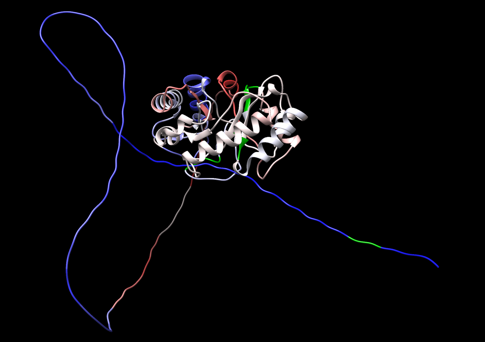

<h1 align="center">MASS-PRF 3D Protein Coloring</h1>
<h3 align="center">Map MASS-PRF outputs onto protein structures in Chimera</h3>

Map MASS-PRF outputs onto protein structures by generating a UCSF Chimera command script that colors residues by selection strength (γ).

## Version recommendation:
Tested with UCSF Chimera 1.17.3. You can also use Chimera 1.19 (latest). The commands are compatible with both versions.

> **What’s new (Oct 2025)**
>
> - Replaced **scaling factor** input with an explicit **output format** (`AA` vs `NT`) to match how MASS-PRF was run.
> - Unified handling of γ → color ramps across _all_ genes in a batch.
> - Clear, explicit significance aggregation for `NT` (per-codon) and `AA` (per-residue) modes.
> - Optional signed log scaling of γ (set `logT` to a numeric base).
> - Safer defaults, cleaner Chimera script emission, and more verbose checks.

---

## Example 3D Output




---

## 1) Installation

### R packages

```r
# core

## What’s new: fixed γ range & out-of-range handling

We added a **fixed gamma range** and a small helper to map γ values consistently across projects. Two new arguments are exposed in the wrapper:

```r
# New parameters (defaults shown)
minGamma = -4
maxGamma = 50
```

**Behavior**

- The global color palette is now built using a **symmetric split** around 0 with separate ramps for negative and positive γ.  
- γ values **below `minGamma`** are clamped into the **lowest (blue) bin**; values **above `maxGamma`** are clamped into the **highest (red) bin**.  
- If `logT` is numeric (e.g., `logT = 2`), the same fixed range is respected in **signed-log space** for smoother contrasts while preserving sign.

**Backwards compatibility**

- If all observed γ already fall within `[minGamma, maxGamma]`, the colors you obtained previously should remain qualitatively consistent, with improved stability across batches.

### Updated function signature (excerpt)

```r
batchMASSPRF_Chimera(
  designFile,
  doOnly     = NULL,
  hasHeader  = FALSE,
  sigSetting = "average",
  onlySig    = FALSE,
  rgb1       = c(250, 30, 30),
  rgb2       = c(30, 30, 250),
  bins       = 510,
  ehColor    = c(180, 180, 180),
  midColor   = c(240, 240, 240),
  logT       = 2,        # numeric for signed-log scaling; use FALSE for linear
  verbose    = FALSE,
  minGamma   = -4,       # NEW: fixed γ lower bound
  maxGamma   = 50        # NEW: fixed γ upper bound
)
```

### Example

```r
batchMASSPRF_Chimera(
  designFile = "design.tsv",
  hasHeader  = TRUE,
  onlySig    = FALSE,
  bins       = 15,
  midColor   = c(240, 240, 240),
  ehColor    = c(0, 180, 0),
  logT       = 2,
  minGamma   = -4,
  maxGamma   = 50
)
```

> Note: We now **conditionally install** dependencies to avoid reinstalling packages you already have:
> ```r
> if (!requireNamespace("BiocManager", quietly = TRUE)) install.packages("BiocManager")
> if (!requireNamespace("msa", quietly = TRUE)) BiocManager::install("msa")
> if (!requireNamespace("bio3d", quietly = TRUE)) install.packages("bio3d")
> ```
> (The script also uses **Biostrings**; please ensure it’s installed: `BiocManager::install("Biostrings")`.)

install.packages(c("readr","dplyr"))

# from Bioconductor
if (!requireNamespace("BiocManager", quietly = TRUE))
  install.packages("BiocManager")
BiocManager::install(c("Biostrings","msa"))

# CRAN
install.packages("bio3d")
```

### Get the script

Place `batchMASSPRF_To_Chimera.R` in your working directory, then:

```r
source("batchMASSPRF_To_Chimera.R")
```

### Chimera

Install **UCSF Chimera** (classic) to visualize and run the generated coloring scripts.

---

## 2) What the script does (overview)

1. **Reads a design TSV** describing each gene/protein to process.  
2. **Parses MASS-PRF tables** (CSV with γ and CIs) and **builds a global γ→color palette** so colors are comparable across all inputs in one batch.  
3. **Aligns sequences**: translates your nucleotide FASTA to AA, aligns it to the PDB-derived sequence (via `msa::msa(..., method="Muscle")`), and maps per-residue colors into structure positions.  
4. **Aggregates significance**:
   - **`format = "NT"`**: groups every 3 nucleotide rows to one amino-acid “site” (codon-level aggregation).
   - **`format = "AA"`**: uses each row as one residue.
   - `sigSetting` controls how multiple rows (NT) decide a site’s significance.
5. **Writes a Chimera command file** (e.g., `*.cmd`) that defines custom colors and applies them to contiguous residue ranges on `#0`.

---

## 3) Inputs

### Design file (TSV)

Set `hasHeader = TRUE` if your TSV has a header. Columns (in order):

1. **pdbList** — path to the PDB file to color  
2. **MASSPRF_Nuc_Fasta_List** — path to _nucleotide_ FASTA from MASS-PRF (in-frame)  
3. **MASSPRF_Table_List** — path to MASS-PRF output **CSV** (contains γ and CIs)  
4. **formatList** — `"AA"` or `"NT"` indicating which MASS-PRF **output format** you used  
5. **outList** — where to write the Chimera command script (e.g., `mygene.cmd`)

#### Minimal example (tab-separated)

```
pdbList	MASSPRF_Nuc_Fasta_List	MASSPRF_Table_List	formatList	outList
/path/to/X.pdb	/path/to/X.fasta	/path/to/X_massprf.csv	AA	/colors/X.cmd
/path/to/Y.pdb	/path/to/Y.fasta	/path/to/Y_massprf.csv	NT	/colors/Y.cmd
```

### MASS-PRF table (CSV) expected columns

The script expects **15** columns (header names can be anything; they are reassigned internally):

```
Position, MS_PolSys, MA_PolSys, MS_PolRep, MA_PolRep,
MS_DivSys, MA_DivSys, MS_DivRep, MA_DivRep,
DivergentTime, Gamma, Lower_CI_Gamma, Upper_CI_Gamma,
PolymorphismMutationStatus, DivergenceMutationStatus
```

The script casts `Gamma`, `Lower_CI_Gamma`, `Upper_CI_Gamma` to numeric.

---

## 4) Function signature & parameters

```r
batchMASSPRF_Chimera(
  designFile,
  doOnly   = NULL,             # optional integer vector of row indices
  hasHeader= FALSE,            # does design TSV include a header row?
  sigSetting = "average",      # "average", "any", "majority", "strict"
  onlySig  = FALSE,            # TRUE = mask non-significant sites to ehColor
  rgb1     = c(250, 30, 30),   # positive γ color (hex ramp high end)
  rgb2     = c(30, 30, 250),   # negative γ color (hex ramp low end)
  bins     = 510,              # number of color bins for the gradient
  ehColor  = c(180, 180, 180), # default “neutral”/gap/non-sig color
  midColor = c(240, 240, 240), # optional midpoint (neutral) color
  logT     = FALSE,            # FALSE=linear, or numeric base for signed log
  verbose  = FALSE             # print progress
)
```

### Key behaviors & tips

- **Format (`AA` vs `NT`)**
  - `AA`: 1 row in MASS-PRF table → 1 residue.
  - `NT`: rows are nucleotides; the script **groups every 3 rows** per codon (per AA “site”) before coloring & significance.

- **Significance test**  
  A site is **significant** if its CI does **not** cross 0 (i.e., `LCI > 0` or `UCI < 0`). NAs are treated as **non-significant**.  
  `sigSetting` for `NT` determines how codon triplets vote:
  - `"any"`: any nucleotide significant → site significant
  - `"majority"`: ≥2 of 3 significant → site significant
  - `"strict"`: all three significant → site significant
  - `"average"` (default): average the CIs across the triplet and test once

- **`onlySig`**  
  When `TRUE`, non-significant sites are colored **`ehColor`** (e.g., grey or green); significant sites get the γ-based gradient color.

- **Signed log scaling (`logT`)**  
  Set to a numeric base (e.g., `2`) to compress large |γ| while keeping the sign:  
  `logGamma = sign(γ) * log(|γ| + 1, base = logT)`.  
  Set to `FALSE` for linear mapping.

- **Color ramp (`rgb2` → `midColor` → `rgb1`)**  
  The ramp flows from negative γ (**`rgb2`**) through optional **`midColor`** to positive γ (**`rgb1`**).  
  Increase `bins` for smoother gradients (up to ~510 workable steps).

- **Global palette**  
  Colors are computed across _all_ inputs in the batch so that the same γ value gets the same color no matter which gene.

---

## 5) Example runs

### Single gene (AA output, linear)

```r
batchMASSPRF_Chimera(
  designFile = "example_inputs/S-design.tsv",
  hasHeader  = TRUE,
  onlySig    = FALSE,
  bins       = 10,
  midColor   = c(240, 245, 240),
  logT       = FALSE
)
```

### Batch (mix of AA & NT, signed log base 2, green “neutral”)

```r
batchMASSPRF_Chimera(
  designFile = "example_inputs/batch-design.tsv",
  hasHeader  = TRUE,
  onlySig    = FALSE,
  bins       = 15,
  midColor   = c(240, 240, 240),
  ehColor    = c(0, 180, 0),
  logT       = 2
)
```

### Subset only rows 2 and 5 from the design

```r
batchMASSPRF_Chimera(
  designFile = "example_inputs/mix-design.tsv",
  hasHeader  = TRUE,
  doOnly     = c(2, 5),
  onlySig    = TRUE,
  bins       = 50,
  logT       = 2
)
```

---

## 6) Using the output in Chimera

1. Open your PDB in Chimera (make sure it’s **model #0** or adapt the script).  
2. In **Chimera Command Line**:

```
read /absolute/path/to/output.cmd;
```

The script:
- Defines custom colors (e.g., `colordef Custom1 #RRGGBB;`)  
- Applies colors to contiguous residue ranges (e.g., `color Custom1 #0:5-18;`)

> **Note:** The script assumes **model `#0`**. If your model number differs, edit `#0:` in the generated file accordingly.

---

## 7) Practical guidance & common pitfalls

- **AA vs NT format matters.**  
  Set `formatList` in the design TSV to **match how the MASS-PRF table was produced**.
  - `AA` output: 1 row/residue → simple mapping.
  - `NT` output: 3 rows/codon → the script aggregates to one residue (see `sigSetting`).

- **Stop codons.**  
  The nucleotide FASTA is translated to AA and `*` are removed automatically:
  ```r
  origUnaligned <- gsub("\\*", "", translate(readDNAStringSet(...)))
  ```

- **Sequence alignment.**  
  We align **translated FASTA** to **PDB sequence** (from `bio3d::pdbseq`) using MUSCLE (via `msa`). Large indels/gaps may produce stretches colored with `ehColor` if positions do not align cleanly.

- **Global palette interpretation.**  
  Because the script pools all γ values first, a residue’s color is meaningful **relative to the whole batch**, not just its own protein.

- **Signed log scaling.**  
  If extreme γ values dominate, consider `logT = 2` (or 10) to spread colors more evenly while preserving sign.

- **Only significant sites.**  
  Set `onlySig = TRUE` if you want a clean map of significant selection only (everything else becomes `ehColor`).

- **Model number in Chimera.**  
  If your PDB is not `#0`, search-replace `#0:` in the output script (or open your PDB first so it becomes `#0`).

---

## 8) Alignment with the current team decisions

- The 3D coloring script **no longer needs a “scaling factor” column**. Instead, we **explicitly specify `format`** (`AA` vs `NT`) in the design TSV.
- Internally:
  - **`AA`**: table rows map 1:1 to residues.
  - **`NT`**: rows are grouped by codon (triplets) to produce a single site per residue; significance is aggregated by `sigSetting`.
- The older logic for “scaled sites” has been removed from the user interface because the 2D output already reports per-site rows and the 3D script consumes those directly.
- The 2D plotting code (separate) should label the x-axis as **“site”** (not “nucleotide position”) to avoid confusion when feeding AA outputs.

---

## 9) Troubleshooting checklist

- **Mismatched lengths** or “Input Lists of different length”:  
  Check your TSV has exactly 5 columns in the correct order.

- **Format error** (“Format column must contain only 'NT' or 'AA'”):  
  Ensure `formatList` cells are spelled exactly `NT` or `AA`.

- **Palette looks weird**:  
  Try `logT = 2` and/or raise `bins` (e.g., 200–510). Consider adding a `midColor`.

- **All grey/neutral** with `onlySig = TRUE`:  
  Your CIs may cross 0 or be `NA`. Try `onlySig = FALSE` to inspect raw γ mapping.

- **Chimera shows no color**:  
  Confirm your structure is model `#0`. If not, edit the generated `#0:` selectors.

---

## 10) Reproducible example (template)

```r
# 1) Prepare a design TSV with columns:
#    pdbList, MASSPRF_Nuc_Fasta_List, MASSPRF_Table_List, formatList, outList
#    (tab-separated).
# 2) Then run:
source("batchMASSPRF_To_Chimera.R")
batchMASSPRF_Chimera(
  designFile = "design.tsv",
  hasHeader  = TRUE,
  onlySig    = FALSE,
  bins       = 15,
  midColor   = c(240, 240, 240),
  ehColor    = c(0, 180, 0),
  logT       = 2,
  verbose    = TRUE
)
# In Chimera:
# Command Line → read /full/path/to/your_output.cmd;
```

---

## 11) FAQ

**Q: Which format should I use?**  
A: Use `AA` if you ran MASS-PRF to produce amino-acid rows (Prof. Townsend’s recommendation). Use `NT` if your MASS-PRF table is nucleotide-level (3× rows). Set `formatList` accordingly in the design TSV.

**Q: How exactly is significance defined?**  
A: A site is significant if its CI excludes zero: `LCI > 0` (positive selection) or `UCI < 0` (negative selection). NAs are treated as non-significant.

**Q: Why do some residues stay neutral (`ehColor`)?**  
A: Gaps, unaligned residues, missing γ/CI, or (with `onlySig=TRUE`) non-significant sites.

**Q: Can I compare colors across proteins?**  
A: Yes—within the same **batch run**, because the palette is computed globally across all γ.

## Authors and Acknowledgments

Special thanks to **Yen-Wen (Denny) Wang** for the code refactoring and  
**Prarthana Sanjeeva Reddy** for testing and improving the AA and NT workflows.  

Their contributions greatly improved the stability and reproducibility of the 3D visualization pipeline.

---

**Original Author:**  
**Nic Fisk**  
Assistant Professor  
Department of Cell and Molecular Biology  
College of the Environment and Life Sciences  
University of Rhode Island  

📧 j.nicholas.fisk@uri.edu
