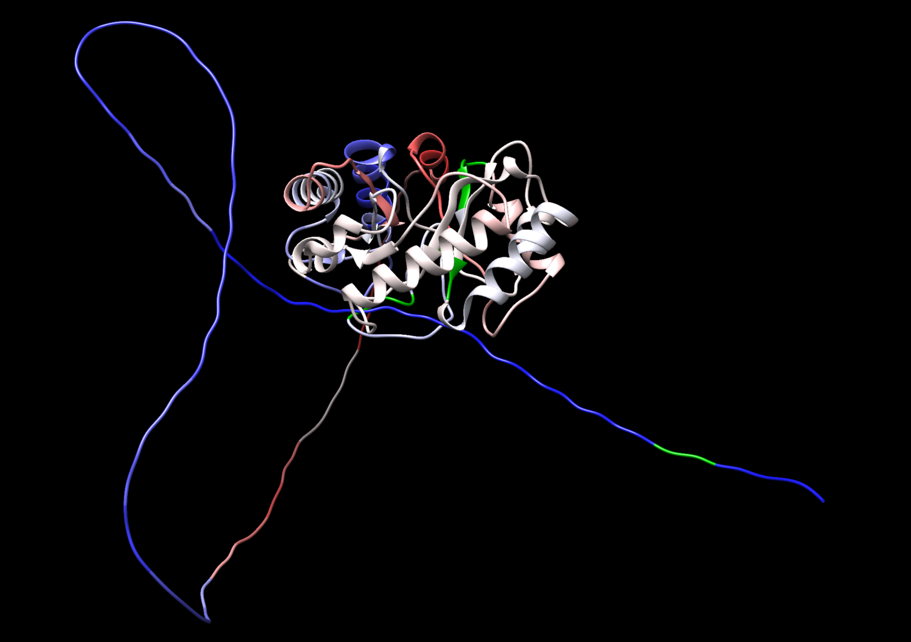

# MASS-PRF 3D Protein Structure Coloring

**Map MASS-PRF selection coefficients onto protein structures in UCSF Chimera**

This script reads MASS-PRF output tables, assigns each residue a color based on its gamma (γ) value, and writes a Chimera command script that colors your protein structure accordingly — blue for negative selection, red for positive selection, neutral for non-significant or unanalyzed sites.

> **Updated by Yide Jin (March 2026)**
> - Added example data files for the five proteins in protocol paper Figure 4 (NPC2, REX4, NBR9, COQ11, ERG11 — *S. cerevisiae*)
> - Script now tolerates extra columns (e.g. a `notes` column) in the design file
> - Expanded beginner-friendly tutorial below

---

## Example output



Residues are colored from blue (purifying selection, low γ) through neutral to red (positive selection, high γ).

---

## Quick-start: reproduce Figure 4 in 5 steps

No prior experience with R or structural biology is required.

### Step 1 — Install R and required packages

Download R from https://cran.r-project.org (free, Windows/Mac/Linux). Then in R or RStudio run:

```r
install.packages(c("bio3d", "readr", "dplyr"))

if (!requireNamespace("BiocManager", quietly = TRUE))
  install.packages("BiocManager")
BiocManager::install(c("Biostrings", "msa"))
```

This only needs to be done once. The `msa` package includes the MUSCLE aligner — no separate installation required.

### Step 2 — Download the example data

All input files for Figure 4 are in the `example-inputs/` folder of this repository:

| File(s) | Gene |
|---|---|
| `PDB_files/AF-Q12408-F1-model_v4.pdb` | NPC2 |
| `PDB_files/AF-Q08237-F1-model_v4.pdb` | REX4 |
| `PDB_files/AF-Q08954-F1-model_v4.pdb` | NBR9 |
| `PDB_files/AF-Q05892-F1-model_v4.pdb` | COQ11 |
| `PDB_files/AF-P10614-F1-model_v4.pdb` | ERG11 |
| `OG0001972.fna` + `OG0001972_out.txt.csv` | NPC2 — nucleotide alignment + MASS-PRF table |
| `OG0003224.fna` + `OG0003224_out.txt.csv` | REX4 |
| `OG0005121.fna` + `OG0005121_out.txt.csv` | NBR9 |
| `OG0005087.fna` + `OG0005087_out.txt.csv` | COQ11 |
| `OG0000435.fna` + `OG0000435_out.txt.csv` | ERG11 |
| `design.tsv` | Master table linking all files above |

Download the entire `example-inputs/` folder and keep all files together in the same directory on your computer.

### Step 3 — Set your working directory in R

```r
# Replace with the actual path on your computer
setwd("C:/Users/YourName/Downloads/example-inputs")   # Windows
# setwd("/Users/YourName/Downloads/example-inputs")   # Mac/Linux
```

In RStudio you can also do this via: **Session -> Set Working Directory -> Choose Directory**.

### Step 4 — Run the script

```r
source("path/to/batchMASSPRF_To_Chimera.R")

batchMASSPRF_Chimera(
  designFile = "design.tsv",
  hasHeader  = TRUE,
  onlySig    = FALSE,
  bins       = 15,
  midColor   = c(240, 240, 240),
  ehColor    = c(0, 180, 0),
  logT       = 2,
  minGamma   = -4,
  maxGamma   = 50,
  verbose    = TRUE
)
```

This produces five `.cscript` files in your working directory:
`NPC2.cscript`, `REX4.cscript`, `NBR9.cscript`, `COQ11.cscript`, `ERG11.cscript`

### Step 5 — Visualize in UCSF Chimera

1. Download **UCSF Chimera** (classic, not ChimeraX) from https://www.cgl.ucsf.edu/chimera/download.html. Tested with versions 1.17.3 and 1.19.
2. Open Chimera. Load a PDB: **File -> Open** and select e.g. `AF-Q12408-F1-model_v4.pdb`. It loads as model `#0`.
3. Open the command line: **Favorites -> Command Line**.
4. Type the following (use the full absolute path to your `.cscript` file):
   ```
   read /full/path/to/NPC2.cscript
   ```
5. The structure is now colored by γ. Red = positive selection, blue = purifying selection, green = no data or non-significant.

> **Tip:** Save a publication-quality image with **File -> Save Image** in Chimera.

---

## How the script works (overview)

1. **Reads a design TSV** — links each protein's PDB file, nucleotide FASTA, and MASS-PRF output table.
2. **Builds a global color palette** — all γ values across the entire batch are pooled into one consistent color scale, so colors are directly comparable across proteins.
3. **Aligns sequences** — the FASTA is translated to amino acids and aligned to the PDB sequence using MUSCLE. This maps positions correctly even when the analyzed sequence and the structure differ by insertions or deletions.
4. **Assigns colors per residue** — each structural residue is matched to its γ value.
5. **Writes Chimera command files** — one `.cscript` per protein, defining custom colors and applying them to residue ranges.

---

## Input file formats

### Design file (TSV) — 5 required columns (in order)

Extra columns (e.g. a `notes` column) are silently ignored.

| Column | Description |
|---|---|
| `pdb` | Path to the PDB file |
| `MASSPRF_Nuc_Fasta` | Path to the in-frame nucleotide FASTA |
| `MASSPRF_Table` | Path to the MASS-PRF output CSV |
| `format` | `AA` (amino-acid level) or `NT` (nucleotide level) |
| `out` | Output `.cscript` filename or path |

Minimal example (tab-separated, with header row):

```
pdb	MASSPRF_Nuc_Fasta	MASSPRF_Table	format	out
PDB_files/AF-Q12408-F1-model_v4.pdb	OG0001972.fna	OG0001972_out.txt.csv	AA	NPC2.cscript
PDB_files/AF-P10614-F1-model_v4.pdb	OG0000435.fna	OG0000435_out.txt.csv	AA	ERG11.cscript
```

### MASS-PRF output table (CSV) — 15 columns

```
Position, MS_PolSys, MA_PolSys, MS_PolRep, MA_PolRep,
MS_DivSys, MA_DivSys, MS_DivRep, MA_DivRep,
DivergentTime, Gamma, Lower_CI_Gamma, Upper_CI_Gamma,
PolymorphismMutationStatus, DivergenceMutationStatus
```

The key columns used for coloring are `Gamma`, `Lower_CI_Gamma`, and `Upper_CI_Gamma`.

---

## Full function reference

```r
batchMASSPRF_Chimera(
  designFile,              # path to design TSV (required)
  doOnly     = NULL,       # integer vector: process only these row numbers
  hasHeader  = FALSE,      # TRUE if design file has a header row
  sigSetting = "average",  # "average", "any", "majority", "strict"
  onlySig    = FALSE,      # TRUE: color only residues with significant gamma
  rgb1       = c(250, 30, 30),    # color for high positive gamma (default: red)
  rgb2       = c(30, 30, 250),    # color for high negative gamma (default: blue)
  bins       = 510,               # number of color bins (higher = smoother gradient)
  ehColor    = c(180, 180, 180),  # color for sites with no data (default: gray)
  midColor   = c(240, 240, 240),  # color for gamma near 0 (default: near-white)
  logT       = 2,          # FALSE = linear scale; 2 or 10 = log-scaled color ramp
  verbose    = FALSE,      # print progress messages
  minGamma   = -4,         # gamma below this is clamped to the lowest (blue) bin
  maxGamma   = 50,         # gamma above this is clamped to the highest (red) bin
  ignoreNA   = FALSE       # TRUE: skip NA-gamma sites (show ehColor); FALSE: error on NA
)
```

**Key parameters explained:**

- **`logT`**: Log-scaling distributes colors more evenly when γ spans a wide range (e.g. −4 to 50). `logT = 2` uses log base 2; `logT = FALSE` uses a linear scale.
- **`sigSetting`** (relevant only when `format = "NT"`, which has 3 nucleotide rows per codon):
  - `"average"` — site is significant if the mean CI excludes zero *(recommended default)*
  - `"any"` — significant if at least one of the 3 rows has CI excluding zero
  - `"majority"` — at least 2 of 3 rows significant
  - `"strict"` — all 3 rows must be significant
- **`onlySig`**: When `TRUE`, non-significant residues are shown only in `ehColor`.
- **`minGamma` / `maxGamma`**: Fixing these ensures colors mean the same thing across different proteins and runs.
- **`ignoreNA`**: Controls how sites with missing gamma values are handled.
  - `FALSE` (default) — follows the original strict execution path; an error will be raised if any site has a missing gamma value. This preserves backward compatibility and helps catch data integrity issues early.
  - `TRUE` — sites with NA gamma values are skipped during color assignment and displayed in the default "no data" color (`ehColor`, gray by default). No error is raised. Use this when some sites are expected to have no gamma estimate (e.g. when PR or DR is too low for a gene).

---

## More example calls

```r
# Color only significant sites; all others shown in gray
batchMASSPRF_Chimera(
  designFile = "design.tsv",
  hasHeader  = TRUE,
  onlySig    = TRUE,
  ehColor    = c(200, 200, 200),
  logT       = 2
)

# Process only rows 1 and 3 from a larger design file
batchMASSPRF_Chimera(
  designFile = "design.tsv",
  hasHeader  = TRUE,
  doOnly     = c(1, 3),
  logT       = 2
)
```

---

## Troubleshooting

| Problem | Likely cause | Fix |
|---|---|---|
| `Error: replacement has N rows, data has M` | Design file column mismatch | Ensure first 5 columns are in the correct order; extra columns are now ignored automatically |
| `Format column must contain only 'NT' or 'AA'` | Typo or trailing space | Check for spaces in the format column; must be exactly `NT` or `AA` |
| All residues show `ehColor` | Sequence alignment failed | Verify the FASTA is an in-frame coding sequence; check for very large insertions/deletions |
| All residues grey/neutral with `onlySig = TRUE` | All confidence intervals cross zero | Run with `onlySig = FALSE` first to confirm data is loading correctly |
| Chimera shows no color change after `read` | Wrong model number | Structure must be model `#0`; if not, edit `#0` in the `.cscript` file to match your model number |
| `Error in read.pdb` | PDB file path is wrong | All paths in design TSV are relative to your R working directory; confirm with `getwd()` |
| Temporary file `_tmpAln.fasta` left behind | Normal behavior | The script writes this file to align sequences; it can be deleted after the run |

---

## Authors and acknowledgments

**Original author:** Nic Fisk, Assistant Professor, Department of Cell and Molecular Biology, College of the Environment and Life Sciences, University of Rhode Island. j.nicholas.fisk@uri.edu

**Code refactoring and NT/AA workflow:** Yen-Wen (Denny) Wang and Prarthana Sanjeeva Reddy

**Example data (Figure 4) and tutorial update (March 2026):** Yide Jin
